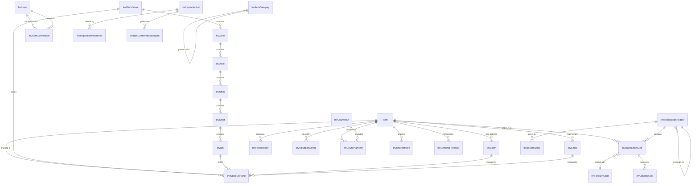
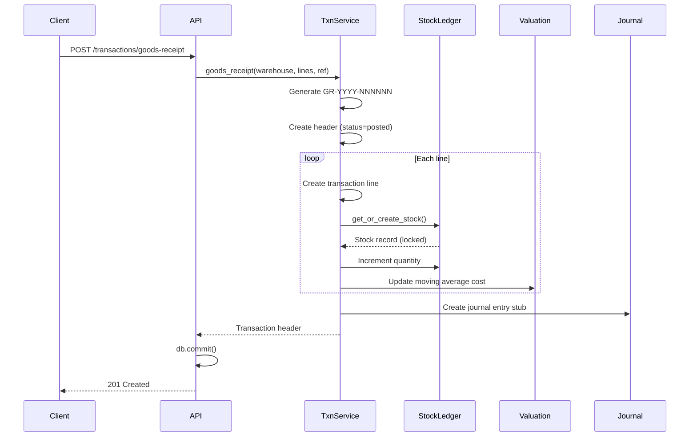
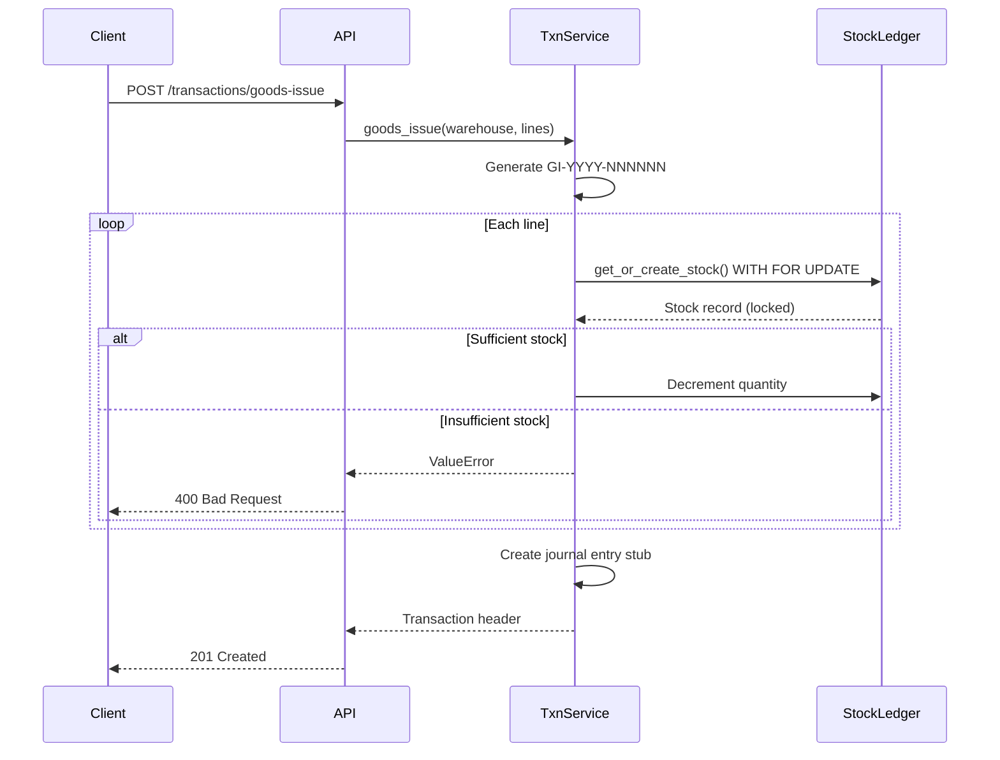
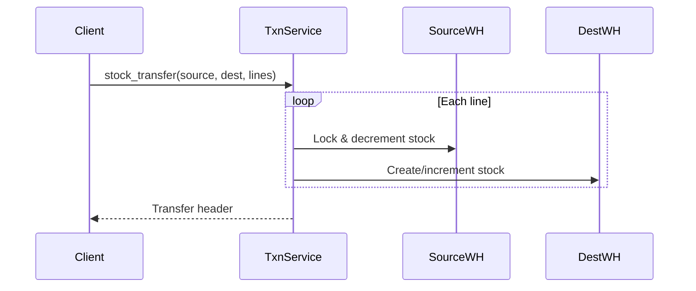
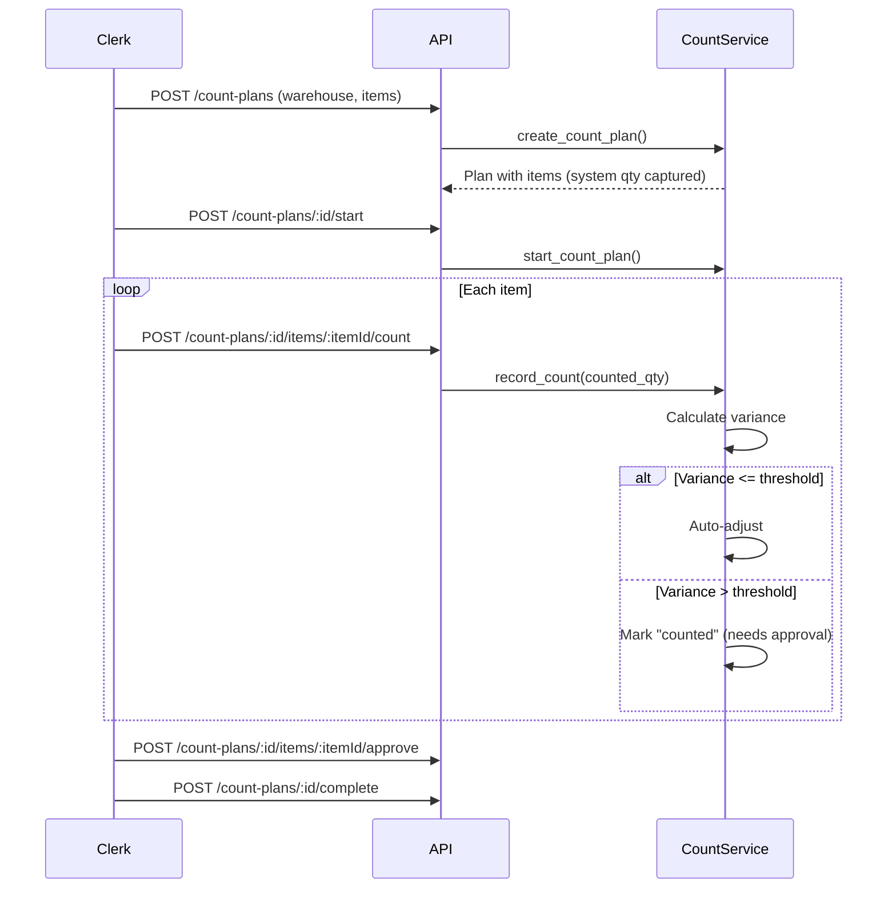

# Inventory Management Module — SAP-Level Documentation

## 1. Architecture Overview

The Inventory Management module is a comprehensive, SAP-inspired addition to the Bookkeeper ERP system. It provides enterprise-grade materials management, warehouse management, and quality management capabilities.

### Design Principles

- **Additive, non-destructive** — All new tables use the `inv_` prefix. Existing tables (Item, Inventory, InventoryTransaction) are preserved and backward-compatible.
- **Immutable ledger** — All posted transactions are immutable. Corrections are done via reversal transactions, never by editing posted records.
- **Service layer pattern** — Routers are thin; all business logic lives in services. Routers handle `db.commit()`.
- **Atomic operations** — All multi-step operations (GR, GI, transfers) run within a single database transaction.
- **Optimistic locking** — Stock records use `with_for_update()` to prevent concurrent modification.

### Module Structure

```
server/app/
├── inv_management/
│   ├── __init__.py
│   ├── schemas.py                 # Pydantic v2 request/response schemas
│   ├── transaction_service.py     # Core transaction engine (GR, GI, transfer, adj, reversal)
│   ├── master_data_service.py     # Categories, UoMs, warehouses, batches, serials
│   ├── operations_service.py      # Reservations, counting, quality, planning
│   ├── reporting_service.py       # Stock overview, KPIs, turnover, slow-movers
│   └── seed.py                    # Reference data seeding
├── routers/
│   └── inv_management.py          # REST API endpoints (/api/v1/inventory/*)
├── models.py                      # SQLAlchemy models (all inv_* tables added)
└── tests/
    └── test_inv_management.py     # Unit + integration tests
```

## 2. Entity Relationship Diagram



## 3. API Reference

All endpoints are under `/api/v1/inventory/` and require the INVENTORY module access.

### Master Data

| Method | Path | Description |
|--------|------|-------------|
| GET | `/uom` | List all units of measure |
| POST | `/uom` | Create a UoM |
| GET | `/uom/conversions` | List UoM conversions |
| POST | `/uom/conversions` | Create a conversion |
| GET | `/categories` | Get category tree |
| POST | `/categories` | Create a category |
| GET | `/categories/:id/children` | Get child categories |
| GET | `/warehouses` | List warehouses |
| POST | `/warehouses` | Create a warehouse |
| GET | `/warehouses/:id` | Get warehouse detail |
| GET | `/warehouses/:id/stock` | Stock in warehouse |
| GET | `/warehouses/:id/zones` | List zones |
| POST | `/warehouses/:id/zones` | Create a zone |

### Batches & Serials

| Method | Path | Description |
|--------|------|-------------|
| GET | `/batches` | List batches (filter by item_id) |
| POST | `/batches` | Create a batch (auto-generates number if omitted) |
| GET | `/batches/:id` | Get batch detail |
| PUT | `/batches/:id?status=...` | Update batch status |
| GET | `/batches/expiring?days=30` | Get batches expiring within N days |
| GET | `/serials` | List serial numbers |
| POST | `/serials` | Create a serial |
| GET | `/serials/:id` | Get serial detail |

### Transactions (Core Engine)

| Method | Path | Description |
|--------|------|-------------|
| POST | `/transactions/goods-receipt` | Create a goods receipt |
| POST | `/transactions/goods-issue` | Create a goods issue |
| POST | `/transactions/stock-transfer` | Transfer between warehouses |
| POST | `/transactions/stock-adjustment` | Adjust stock quantities |
| POST | `/transactions/:id/reverse` | Reverse a posted transaction |
| GET | `/transactions` | List with filters & pagination |
| GET | `/transactions/:id` | Get transaction with lines |

### Reservations

| Method | Path | Description |
|--------|------|-------------|
| GET | `/reservations` | List reservations |
| POST | `/reservations` | Create a reservation |
| PUT | `/reservations/:id/fulfill` | Fulfill a reservation |
| PUT | `/reservations/:id/cancel` | Cancel a reservation |

### Cycle Counting

| Method | Path | Description |
|--------|------|-------------|
| GET | `/count-plans` | List count plans |
| POST | `/count-plans` | Create a count plan |
| GET | `/count-plans/:id` | Get plan with items |
| POST | `/count-plans/:id/start` | Start counting |
| POST | `/count-plans/:id/items/:itemId/count` | Record a count |
| POST | `/count-plans/:id/items/:itemId/approve` | Approve variance |
| POST | `/count-plans/:id/complete` | Complete the plan |

### Quality Management

| Method | Path | Description |
|--------|------|-------------|
| GET | `/quality/inspection-lots` | List inspection lots |
| POST | `/quality/inspection-lots` | Create an inspection lot |
| GET | `/quality/inspection-lots/:id` | Get lot detail |
| PUT | `/quality/inspection-lots/:id` | Record inspection results |
| POST | `/quality/inspection-lots/:id/decide` | Make usage decision |
| GET | `/quality/ncr` | List NCRs |
| POST | `/quality/ncr` | Create an NCR |
| GET | `/quality/ncr/:id` | Get NCR detail |

### Planning

| Method | Path | Description |
|--------|------|-------------|
| GET | `/planning/reorder-alerts` | List reorder alerts |
| POST | `/planning/reorder-check` | Trigger reorder point check |
| GET | `/planning/forecast/:itemId` | Generate demand forecast |

### Reports & Analytics

| Method | Path | Description |
|--------|------|-------------|
| GET | `/reports/stock-overview` | Stock by item × warehouse × stock type |
| GET | `/reports/dashboard` | KPI dashboard data |
| GET | `/reports/inventory-turnover` | Turnover ratio & days on hand |
| GET | `/reports/slow-moving` | Items with no movement |
| GET | `/reports/transaction-history` | Full audit trail |

### Settings

| Method | Path | Description |
|--------|------|-------------|
| GET | `/settings` | Get all settings |
| PUT | `/settings` | Update settings (JSON body: {key: value, ...}) |

## 4. Transaction Flow Diagrams

### Goods Receipt Flow



### Goods Issue Flow



### Stock Transfer Flow



### Cycle Count Flow



## 5. Valuation Methods

### Moving Average (Default)
On each receipt:
```
new_avg = ((existing_qty × old_avg) + (receipt_qty × receipt_price)) / (existing_qty + receipt_qty)
```

Example: 100 units @ $10, receive 50 @ $20:
```
new_avg = ((100 × 10) + (50 × 20)) / 150 = 2000 / 150 = $13.33
```

### Supported Methods (via `inv_valuation_configs.valuation_method`)
- `moving_average` — recalculated on every receipt
- `standard_cost` — fixed cost, variances posted to PPV account
- `weighted_average` — period-end recalculation
- `fifo` — first in, first out (cost layers)
- `lifo` — last in, first out (cost layers)
- `specific_identification` — per serial/batch cost

## 6. Configuration Guide

Settings stored in `inv_settings` (key-value):

| Key | Default | Description |
|-----|---------|-------------|
| `default_valuation_method` | `moving_average` | Valuation method for new items |
| `auto_generate_batch_numbers` | `true` | Auto-generate batch numbers on receipt |
| `batch_number_pattern` | `{SKU}-{YYYYMMDD}-{SEQ}` | Pattern for batch numbers |
| `variance_auto_adjust_threshold_pct` | `2.0` | Auto-adjust count variance if within this % |
| `negative_stock_allowed` | `false` | Allow stock to go negative |
| `reservation_expiry_days` | `30` | Days before reservations expire |
| `default_pick_strategy` | `FIFO` | Picking strategy |
| `fifo_enforcement` | `true` | Enforce FIFO on goods issue |

## 7. Database Tables (28 new tables)

| Table | Purpose |
|-------|---------|
| `inv_item_categories` | Hierarchical category tree |
| `inv_uom` | Units of measure master |
| `inv_uom_conversions` | UoM conversion factors |
| `inv_warehouses` | Warehouse master |
| `inv_zones` | Zones within warehouses |
| `inv_aisles` | Aisles within zones |
| `inv_racks` | Racks within aisles |
| `inv_shelves` | Shelves within racks |
| `inv_bins` | Storage bins (most granular location) |
| `inv_batches` | Batch/lot tracking |
| `inv_serials` | Serial number tracking |
| `inv_reason_codes` | Reason codes for transactions |
| `inv_stock_on_hand` | Granular stock ledger |
| `inv_transaction_headers` | Immutable transaction headers |
| `inv_transaction_lines` | Immutable transaction lines |
| `inv_valuation_configs` | Valuation method per item |
| `inv_valuation_history` | Period-end valuation snapshots |
| `inv_landing_costs` | Landed cost allocation |
| `inv_reservations` | Formal reservations with expiry |
| `inv_putaway_rules` | Putaway rules |
| `inv_pick_lists` | Pick list headers |
| `inv_pick_list_lines` | Pick list line items |
| `inv_count_plans` | Cycle count plans |
| `inv_count_plan_items` | Items within count plans |
| `inv_inspection_lots` | Quality inspection lots |
| `inv_inspection_parameters` | Inspection test parameters |
| `inv_non_conformance_reports` | NCRs for quality defects |
| `inv_reorder_alerts` | Automated reorder alerts |
| `inv_demand_forecasts` | Demand forecasts |
| `inv_settings` | Module configuration |
| `inv_journal_entries` | Accounting journal stubs |

## 8. Setup Instructions

### 1. Run migrations
```bash
cd server
alembic upgrade head
```

### 2. Seed reference data
```python
from app.db import SessionLocal
from app.inv_management.seed import seed_inventory_module

db = SessionLocal()
counts = seed_inventory_module(db)
db.commit()
print(counts)
```

Or add to your existing seed script.

### 3. Verify API
```bash
# List warehouses (should be empty or seeded)
curl http://localhost:8000/api/v1/inventory/warehouses

# Create a warehouse
curl -X POST http://localhost:8000/api/v1/inventory/warehouses \
  -H "Content-Type: application/json" \
  -H "Authorization: Bearer <token>" \
  -d '{"code": "WH-01", "name": "Main Warehouse"}'
```

## 9. Testing Guide

### Run all inventory tests
```bash
cd server
python -m pytest app/tests/test_inv_management.py -v
```

### Test coverage
```bash
python -m pytest app/tests/test_inv_management.py --cov=app/inv_management --cov-report=term-missing
```

### What's covered
- **Master Data**: Category CRUD, hierarchy, UoM creation, warehouse hierarchy
- **Transactions**: Goods receipt (single/multi-line), goods issue (success/insufficient), stock transfer, adjustments (positive/negative/prevent-negative), reversals (success/double-reverse/not-found)
- **Operations**: Reservations (create/fulfill/cancel), count plans, quality inspections, NCRs, reorder alerts
- **Reporting**: Stock overview, dashboard KPIs, slow-moving items
- **Integration**: Full GR workflow, GI workflow, transfer workflow, reversal restoration, moving average calculation
- **Seed**: Idempotent seeding
